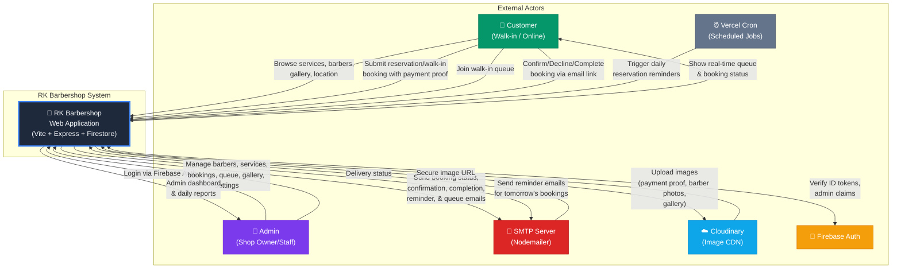
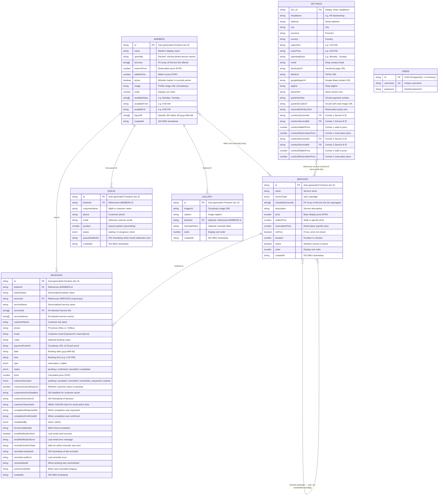
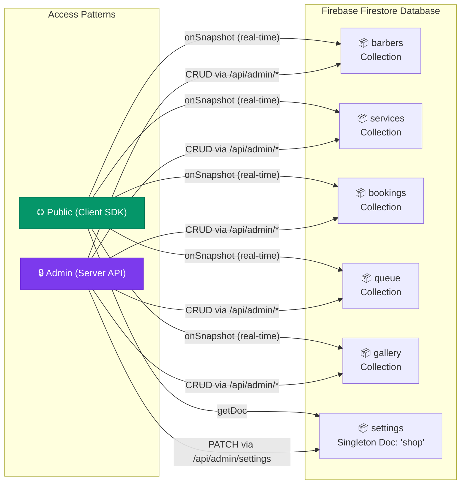
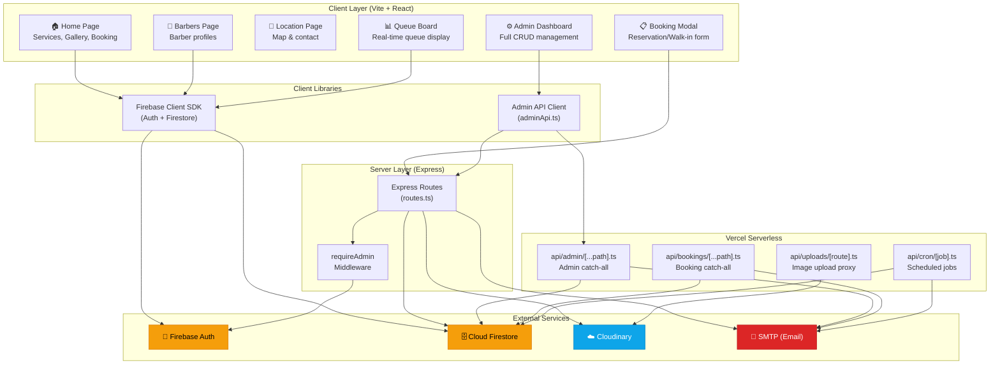
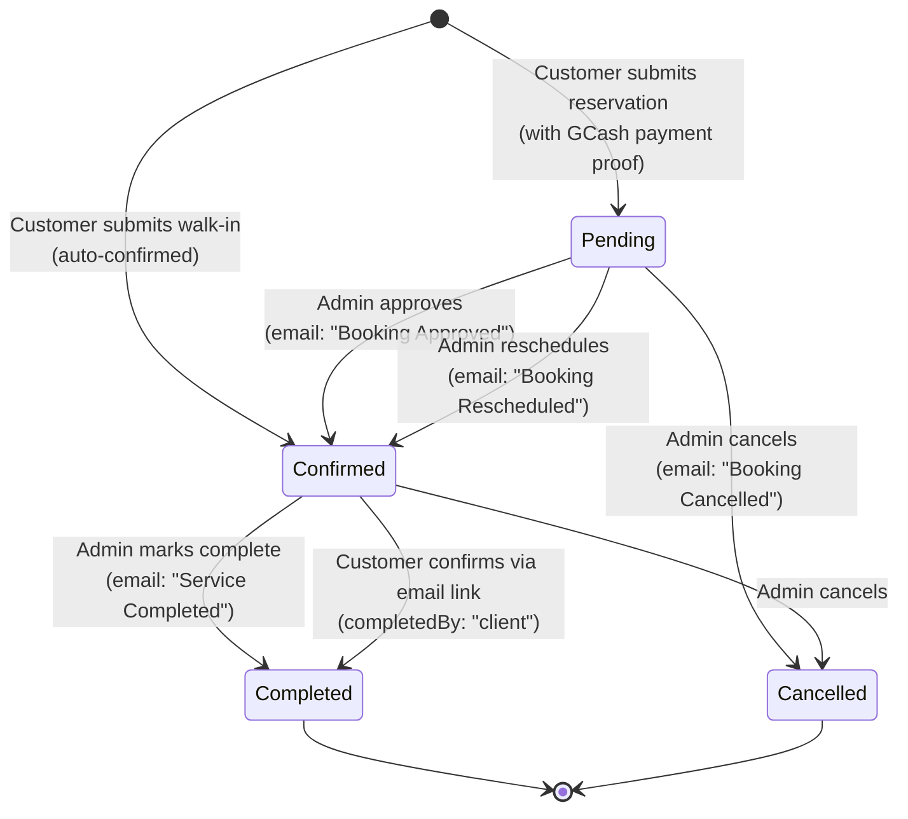

# RK Barbershop System — ERD & Context Diagram

> [!NOTE]
> All diagrams below are **derived directly from the source code** — specifically from [types.ts](file:///c:/Users/james.DESKTOP-GRBUCUA/OneDrive/Desktop/RKBarber/RKBarber-main/client/src/lib/types.ts), [routes.ts](file:///c:/Users/james.DESKTOP-GRBUCUA/OneDrive/Desktop/RKBarber/RKBarber-main/server/routes.ts), [firestore.ts](file:///c:/Users/james.DESKTOP-GRBUCUA/OneDrive/Desktop/RKBarber/RKBarber-main/client/src/lib/firestore.ts), [schema.ts](file:///c:/Users/james.DESKTOP-GRBUCUA/OneDrive/Desktop/RKBarber/RKBarber-main/shared/schema.ts), and the Zod validation schemas in the server routes. No hallucinated entities or fields.

---

## 1. Context Diagram (Level 0 DFD)

This shows the system boundary and all external actors that interact with RK Barbershop.

---

## 2. Entity Relationship Diagram (ERD)

The system uses **two data stores**:
1. **Firebase Firestore** (NoSQL) — Primary data store for all business entities (6 collections)
2. **PostgreSQL via Drizzle** (optional/legacy) — Only `users` table defined in `shared/schema.ts`, used via in-memory storage

### 2.1 Complete ERD

### 2.2 Relationship Summary Table

| Relationship | Type | Implementation | Source Field(s) |
|---|---|---|---|
| Barber → Bookings | One-to-Many | `bookings.barberId` references `barbers.id` | `BOOKINGS.barberId` |
| Barber → Queue | One-to-Many | `queue.barberId` references `barbers.id` | `QUEUE.barberId` |
| Barber → Gallery | One-to-Many (optional) | `gallery.barberId` references `barbers.id` | `GALLERY.barberId` |
| Barber ↔ Services | Many-to-Many | `barbers.services[]` stores array of service IDs | `BARBERS.services` |
| Service → Bookings | One-to-Many | `bookings.serviceId` & `bookings.serviceIds[]` | `BOOKINGS.serviceId`, `BOOKINGS.serviceIds` |
| Service → Service | Self-referencing (package) | `services.includedServiceIds[]` for packages | `SERVICES.includedServiceIds` |
| Settings → Services | Reference (combos) | `settings.combo1ServiceAId`, etc. | `SETTINGS.combo1ServiceAId/BId`, `combo2...` |
| Users (standalone) | No FK relationships | In-memory storage; not linked to Firestore entities | — |

> [!IMPORTANT]
> **Firestore is schemaless** — relationships are enforced at the application layer (Zod schemas + route handlers), not by the database. All foreign keys above are logical, not database-enforced constraints.

---

## 3. Firestore Collections Map

---

## 4. System Architecture Overview

---

## 5. Data Flow — Booking Lifecycle

---

## 6. API Endpoints Summary

| Method | Endpoint | Auth | Purpose |
|---|---|---|---|
| `GET` | `/api/health` | None | Health check |
| `GET` | `/api/users/:id` | None | Get user by ID |
| `GET` | `/api/users?username=` | None | Get user by username |
| `POST` | `/api/users` | None | Create user |
| `POST` | `/api/uploads/image` | None | Upload image to Cloudinary |
| `GET` | `/api/uploads/download` | None | Proxy download from Cloudinary |
| `POST` | `/api/bookings` | None | Create booking (reservation/walk-in) |
| `GET` | `/api/bookings/action` | Token | Customer email action (confirm/decline/complete) |
| `GET` | `/api/cron/expire-bookings` | Cron | Legacy — disabled |
| `GET` | `/api/cron/send-reservation-reminders` | Cron | Send tomorrow's booking reminders |
| `GET` | `/api/admin/bookings` | Admin | List all bookings |
| `PATCH` | `/api/admin/bookings/:id` | Admin | Update booking status/schedule |
| `DELETE` | `/api/admin/bookings/:id` | Admin | Delete booking |
| `PATCH` | `/api/admin/queue/:id` | Admin | Update queue item |
| `DELETE` | `/api/admin/queue/:id` | Admin | Remove from queue |
| `POST` | `/api/admin/queue/call-next` | Admin | Email next customers in queue |
| `POST` | `/api/admin/services` | Admin | Create service |
| `PATCH` | `/api/admin/services/:id` | Admin | Update service |
| `DELETE` | `/api/admin/services/:id` | Admin | Delete service |
| `POST` | `/api/admin/barbers` | Admin | Create barber |
| `PATCH` | `/api/admin/barbers/:id` | Admin | Update barber |
| `DELETE` | `/api/admin/barbers/:id` | Admin | Delete barber |
| `PATCH` | `/api/admin/settings` | Admin | Update shop settings |
| `POST` | `/api/admin/gallery` | Admin | Add gallery item |
| `PATCH` | `/api/admin/gallery/:id` | Admin | Update gallery item |
| `DELETE` | `/api/admin/gallery/:id` | Admin | Delete gallery item |

---

## 7. Tech Stack Summary

| Layer | Technology |
|---|---|
| Frontend Framework | React + TypeScript (Vite) |
| Routing | Wouter |
| UI Components | shadcn/ui (Radix + Tailwind) |
| State | React hooks + Firebase `onSnapshot` (real-time) |
| Backend | Express.js (dev) / Vercel Serverless (prod) |
| Database | Cloud Firestore (6 collections) |
| Auth | Firebase Authentication (Email/Password) |
| Image Storage | Cloudinary (via server-side signed upload) |
| Email | Nodemailer via SMTP |
| Cron Jobs | Vercel Cron (daily reservation reminders) |
| Schema Validation | Zod (server-side) |
| Deployment | Vercel |

> [!TIP]
> The `USERS` table (PostgreSQL/Drizzle in `shared/schema.ts`) exists as a **legacy/scaffold artifact** from the initial project template. The system's actual user management is handled entirely through **Firebase Authentication**, not this table. The in-memory `MemStorage` class wrapping it is unused in production flows.
